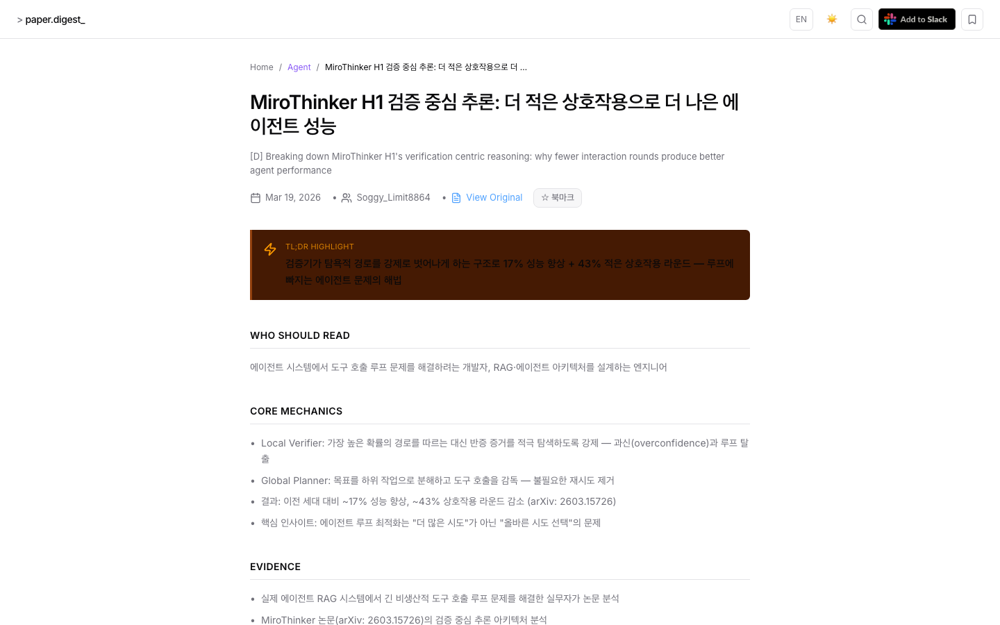
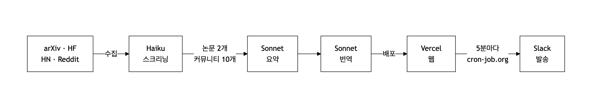

<div align="center">

# AI Paper Digest

**AI 에이전트를 쓰거나 만드는 개발자를 위한 매일 AI 논문 · 커뮤니티 요약.**

[](https://nextjs.org)
[](https://anthropic.com)
[](https://typescriptlang.org)
[](LICENSE)

**[paper-digest.app](https://paper-digest.app)** · [English](README.md)

</div>

---




---

## 이게 뭔가요?

매일 아침 수백 개의 AI 논문과 커뮤니티 글이 쏟아집니다. AI로 제품을 만드는 개발자에게 대부분은 필요 없습니다 — 모델 학습, 액션 없는 벤치마크, 아무도 적용 못 할 도메인 특화 연구들이니까요.

AI Paper Digest는 그 노이즈를 걷어냅니다. arXiv, HuggingFace, Hacker News, Reddit에서 매일 자동 수집하고, 엄격한 AI 스크리닝을 거쳐 AI 에이전트, 프롬프팅, RAG를 다루는 개발자에게 실제로 도움되는 것들만 요약해서 전달합니다.

기준이 높습니다: 대략 **10개 중 1개만 통과**합니다.

---

## 어떻게 작동하나요?

GitHub Actions 파이프라인이 매일 KST 07:00에 자동 실행됩니다:




| 단계 | 스크립트 | 소스 | 처리 | 결과 |
|------|----------|------|------|------|
| 1. 논문 수집 | `collect-papers.ts` | arXiv 100개 + HuggingFace 40개 | Claude Haiku 스크리닝 (score ≥ 7) | 최대 2개 |
| 2. 커뮤니티 수집 | `collect-community.ts` | HN 100개 + Reddit 150개 | Claude Haiku 스크리닝 (score ≥ 6) | 최대 10개 |
| 3. 커뮤니티 요약 | `digest-community.ts` | 원문 + 댓글 전체 | Claude Sonnet 요약 | 최대 10개 |
| 4. 논문 요약 | `summarize.ts` | PDF 전문 | Claude Sonnet 요약 | 최대 2개 |
| 5. 영어 번역 | `translate.ts` | 한국어 요약 | Claude Sonnet 번역 | 최대 12개 |
| 6. 재배포 | `redeploy.yml` | — | Vercel 프로덕션 배포 | — |
| 7. Slack 발송 | `api/cron/slack-drip` | — | cron-job.org (5분마다) | 최대 20개/일 |

각 요약 항목:
- 한 줄 요약 (TL;DR)
- 핵심 발견
- 근거와 수치
- 실무 적용 가이드
- 용어 사전
- 한/영 모두 제공

---

## Slack 구독

사이트에서 Add to Slack으로 워크스페이스에 바로 추가할 수 있습니다. 하루 종일 순차적으로 전달 — 피드를 따로 확인할 필요 없습니다.

---

## Tech Stack

| 영역 | 기술 |
|------|------|
| Framework | Next.js 15, React 19, TypeScript 5 |
| AI | Claude Sonnet (요약) · Haiku (스크리닝) |
| Database | Turso + Drizzle ORM |
| Styling | Tailwind CSS v4 + shadcn/ui |
| Infra | GitHub Actions + Vercel + cron-job.org |

---

## 로컬 실행

```bash
git clone https://github.com/kangraemin/ai-paper-digest.git
cd ai-paper-digest
npm install
cp .env.example .env.local
npx drizzle-kit push
npm run dev   # http://localhost:3000
```

## Contributing

PR 환영합니다. 버그 리포트와 기능 제안은 [Issues](../../issues)로 남겨주세요.

## License

MIT
