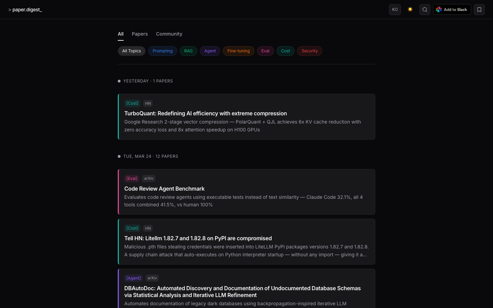
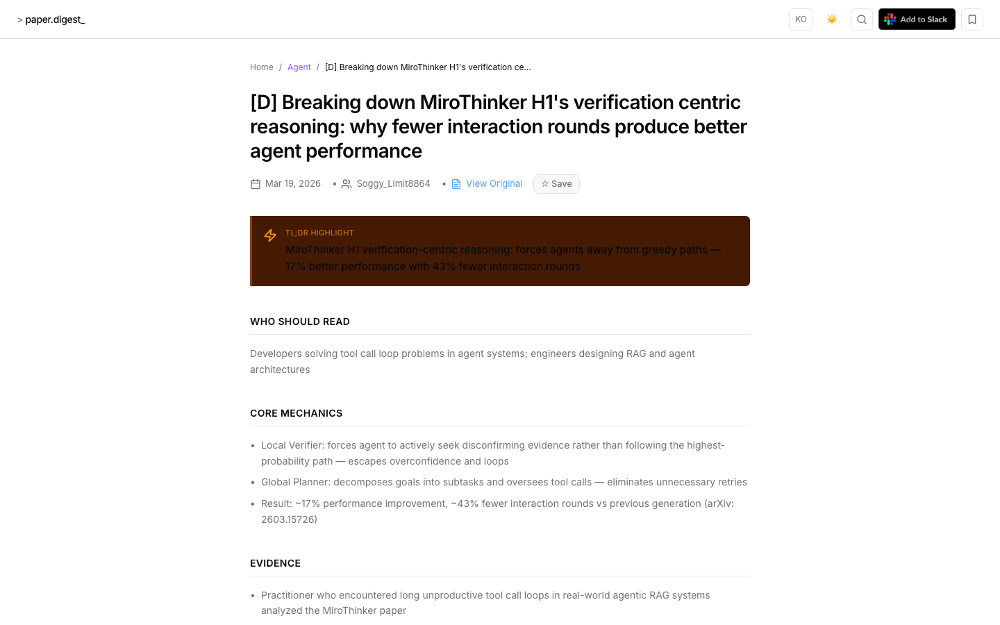
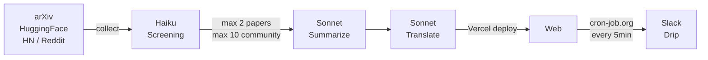

<div align="center">

# AI Paper Digest

**Daily AI paper & community digest, curated for developers building with AI.**

[](https://nextjs.org)
[](https://anthropic.com)
[](https://typescriptlang.org)
[](LICENSE)

**[ai-paper-delta.vercel.app](https://ai-paper-delta.vercel.app)** · [한국어](README.ko.md)

</div>

---




---

## What is this?

Every morning, hundreds of AI papers and community posts come out. Most of them aren't useful if you're a developer building products with AI — they're about model training, benchmarks without actionable takeaways, or domain-specific research you'll never apply.

AI Paper Digest cuts through the noise. It automatically collects from arXiv, HuggingFace, Hacker News, and Reddit every day, runs strict AI-powered screening, and delivers summaries designed for developers who use AI agents, prompting, and RAG — not ML researchers.

The bar is high: roughly **1 in 10 papers makes it through**.

---

## How it works

A GitHub Actions pipeline runs automatically every day at 07:00 KST:




| Step | Script | Source | Filter | Output |
|------|--------|--------|--------|--------|
| 1. Collect papers | `collect-papers.ts` | arXiv 100 + HuggingFace 40 | Claude Haiku screening (score ≥ 7) | Max 2/day |
| 2. Collect community | `collect-community.ts` | HN 100 + Reddit 150 | Claude Haiku screening (score ≥ 6) | Max 10/day |
| 3. Summarize community | `digest-community.ts` | Full post + comments | Claude Sonnet | Max 10/day |
| 4. Summarize papers | `summarize.ts` | Full PDF text | Claude Sonnet | Max 2/day |
| 5. Translate | `translate.ts` | Korean summaries | Claude Sonnet | Max 12/day |
| 6. Redeploy | `redeploy.yml` | — | Vercel production deploy | — |
| 7. Slack drip | `api/cron/slack-drip` | — | cron-job.org (every 5min) | Max 20/day |

**Screening criteria for papers** — passes only if:
- Immediately applicable without model training or infra setup
- A developer can change their prompting or tool usage based on this
- Non-obvious, not already common knowledge

**Screening criteria for community** — passes only if:
- Technical tutorial, deep dive, or real-world experience with AI tools
- Developer workflow or productivity content with substance

Each summary includes:
- TL;DR (one-liner)
- Core mechanics / key findings
- Evidence with specific numbers
- How to apply
- Terminology glossary
- Korean and English

---

## Slack Integration

Add to your Slack workspace directly from the site. Summaries are delivered throughout the day — no feed to check, no tab to keep open.

---

## Tech Stack

| Area | Tech |
|------|------|
| Framework | Next.js 15, React 19, TypeScript 5 |
| AI | Claude Sonnet (summarization) · Haiku (screening) |
| Database | Turso + Drizzle ORM |
| Styling | Tailwind CSS v4 + shadcn/ui |
| Infra | GitHub Actions + Vercel + cron-job.org |

---

## Run locally

```bash
git clone https://github.com/kangraemin/ai-paper-digest.git
cd ai-paper-digest
npm install
cp .env.example .env.local
npx drizzle-kit push
npm run dev   # http://localhost:3000
```

## Contributing

PRs welcome. Bug reports and feature requests via [Issues](../../issues).

## License

MIT
