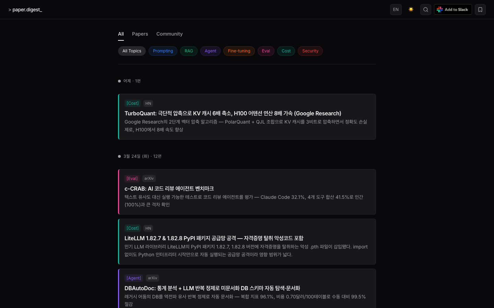
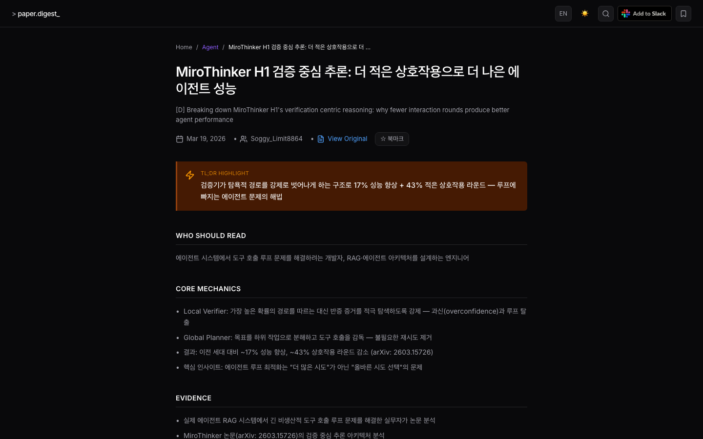

<div align="center">

# AI Paper Digest

**Daily AI paper & community digest, curated for developers building with AI.**

[](https://nextjs.org)
[](https://anthropic.com)
[](https://typescriptlang.org)
[](LICENSE)

**[ai-paper-delta.vercel.app](https://ai-paper-delta.vercel.app)**

</div>

---


---

## What is this?

Every morning, hundreds of AI papers and community posts come out. Most of them aren't useful if you're a developer building products with AI — they're about model training, benchmarks without actionable takeaways, or domain-specific research you'll never apply.

AI Paper Digest cuts through the noise. It automatically collects from arXiv, HuggingFace, Hacker News, and Reddit every day, runs strict AI-powered screening, and delivers summaries designed for developers who use AI agents, prompting, and RAG — not ML researchers.

The bar is high: roughly 1 in 10 papers makes it through.

---

## Screenshots

| Korean | Detail |
|--------|--------|
|  |  |

---

## How it works

A GitHub Actions pipeline runs automatically every day at 07:00 KST:

| Step | Script | Source | Filter | Output |
|------|--------|--------|--------|--------|
| 1. Collect papers | `collect-papers.ts` | arXiv 100 + HuggingFace 40 | Claude Haiku screening (score ≥ 7) | Max 2/day |
| 2. Collect community | `collect-community.ts` | HN 100 + Reddit 150 | Claude Haiku screening (score ≥ 6) | Max 10/day |
| 3. Summarize community | `digest-community.ts` | Full post + comments | Claude Sonnet | Max 10/day |
| 4. Summarize papers | `summarize.ts` | Full PDF text | Claude Sonnet | Max 2/day |
| 5. Translate | `translate.ts` | Korean summaries | Claude Sonnet | Max 12/day |
| 6. Redeploy | `redeploy.yml` | — | Vercel production deploy | — |

**Screening criteria for papers** — passes only if all of these are true:
- Immediately applicable without model training or infra setup
- A developer can change their prompting or tool usage based on this
- Non-obvious, not already common knowledge

**Screening criteria for community** — passes only if:
- Technical tutorial, deep dive, or real-world experience with AI tools
- Developer workflow or productivity content with substance

Each summary includes:
- TL;DR (one-liner)
- Core mechanics / key findings
- Evidence with specific numbers
- How to apply
- Terminology glossary
- Korean and English

---

## Slack Integration

Add to your Slack workspace directly from the site. Summaries are delivered throughout the day via drip — no feed to check, no tab to keep open.

---

## Tech Stack

| Area | Tech |
|------|------|
| Framework | Next.js 15, React 19, TypeScript 5 |
| AI | Claude Sonnet (summarization) · Haiku (screening) |
| Database | Turso + Drizzle ORM |
| Styling | Tailwind CSS v4 + shadcn/ui |
| Infra | GitHub Actions + Vercel |

---

## Run locally

```bash
git clone https://github.com/kangraemin/ai-paper-digest.git
cd ai-paper-digest
npm install
cp .env.example .env.local
npx drizzle-kit push
npm run dev   # http://localhost:3000
```

---

## Contributing

PRs welcome. Bug reports and feature requests via [Issues](../../issues).

---

## License

MIT

---

<div align="center">

# AI Paper Digest (한국어)

**AI 에이전트를 쓰거나 만드는 개발자를 위한 매일 AI 논문 · 커뮤니티 요약.**

</div>

---

## 이게 뭔가요?

매일 아침 수백 개의 AI 논문과 커뮤니티 글이 쏟아집니다. AI로 제품을 만드는 개발자에게 대부분은 필요 없습니다 — 모델 학습, 액션 없는 벤치마크, 아무도 적용 못 할 도메인 특화 연구들이니까요.

AI Paper Digest는 그 노이즈를 걷어냅니다. arXiv, HuggingFace, Hacker News, Reddit에서 매일 자동 수집하고, 엄격한 AI 스크리닝을 거쳐 AI 에이전트, 프롬프팅, RAG를 다루는 개발자에게 실제로 도움되는 것들만 요약해서 전달합니다.

기준이 높습니다: 대략 10개 중 1개만 통과합니다.

---

## 어떻게 작동하나요?

GitHub Actions 파이프라인이 매일 KST 07:00에 자동 실행됩니다:

| 단계 | 스크립트 | 소스 | 처리 | 결과 |
|------|----------|------|------|------|
| 1. 논문 수집 | `collect-papers.ts` | arXiv 100개 + HuggingFace 40개 | Claude Haiku 스크리닝 (score ≥ 7) | 최대 2개 |
| 2. 커뮤니티 수집 | `collect-community.ts` | HN 100개 + Reddit 150개 | Claude Haiku 스크리닝 (score ≥ 6) | 최대 10개 |
| 3. 커뮤니티 요약 | `digest-community.ts` | 원문 + 댓글 전체 | Claude Sonnet 요약 | 최대 10개 |
| 4. 논문 요약 | `summarize.ts` | PDF 전문 | Claude Sonnet 요약 | 최대 2개 |
| 5. 영어 번역 | `translate.ts` | 한국어 요약 | Claude Sonnet 번역 | 최대 12개 |
| 6. 재배포 | `redeploy.yml` | — | Vercel 프로덕션 배포 | — |

각 요약 항목:
- 한 줄 요약 (TL;DR)
- 핵심 발견
- 근거와 수치
- 실무 적용 가이드
- 용어 사전
- 한/영 모두 제공

---

## Slack 구독

사이트에서 Add to Slack으로 워크스페이스에 바로 추가할 수 있습니다. 하루 종일 drip 방식으로 전달 — 피드를 확인할 필요 없습니다.

---

## Contributing

PR 환영합니다. 버그 리포트와 기능 제안은 [Issues](../../issues)로 남겨주세요.

## License

MIT
